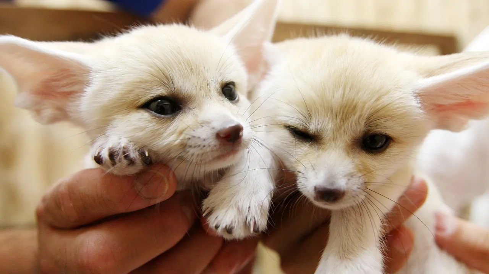
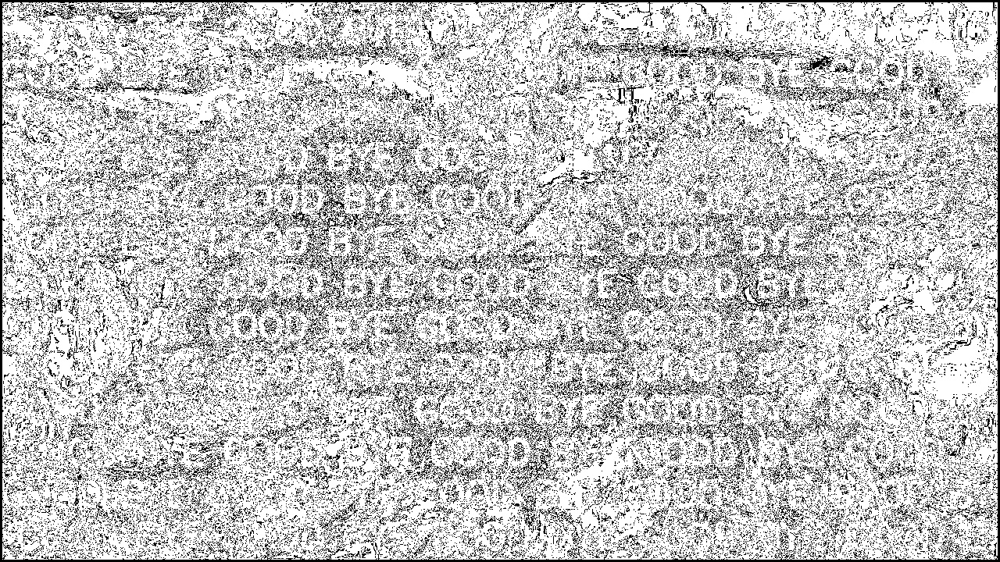

# hidden-waterMark-python

This project is a machine learning project that hidden watermark (Pass:Rotate, Resize, Compress,Brightness,...).

# Run

Encode:$ python main.py --image dog.jpg --wm "GOOD BYE" --mode encode --output dog_encode.jpg

Decode:$ python main.py --image dog_encode.jpg --mode decode --output dog_wm.jpg
